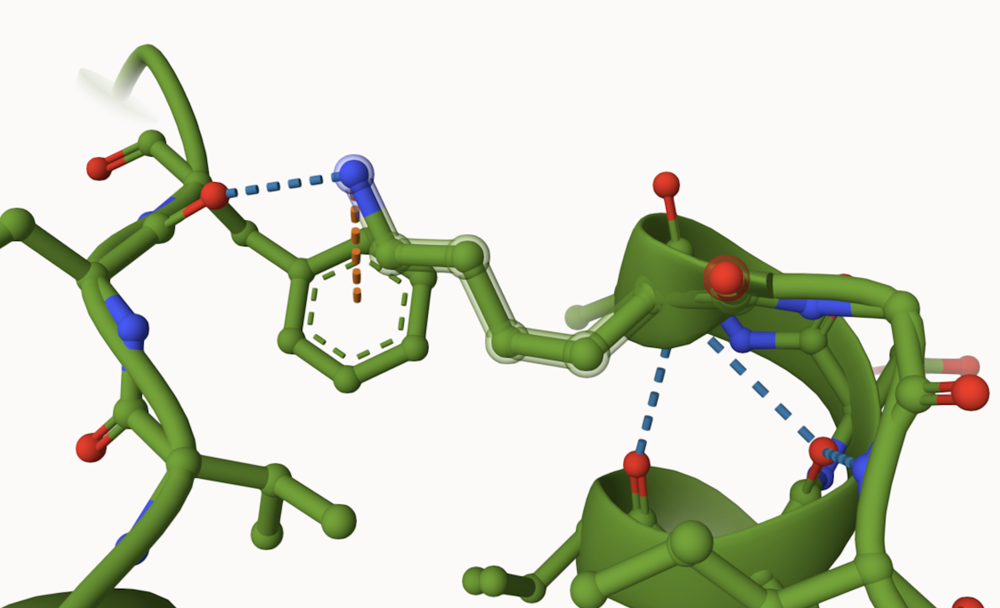
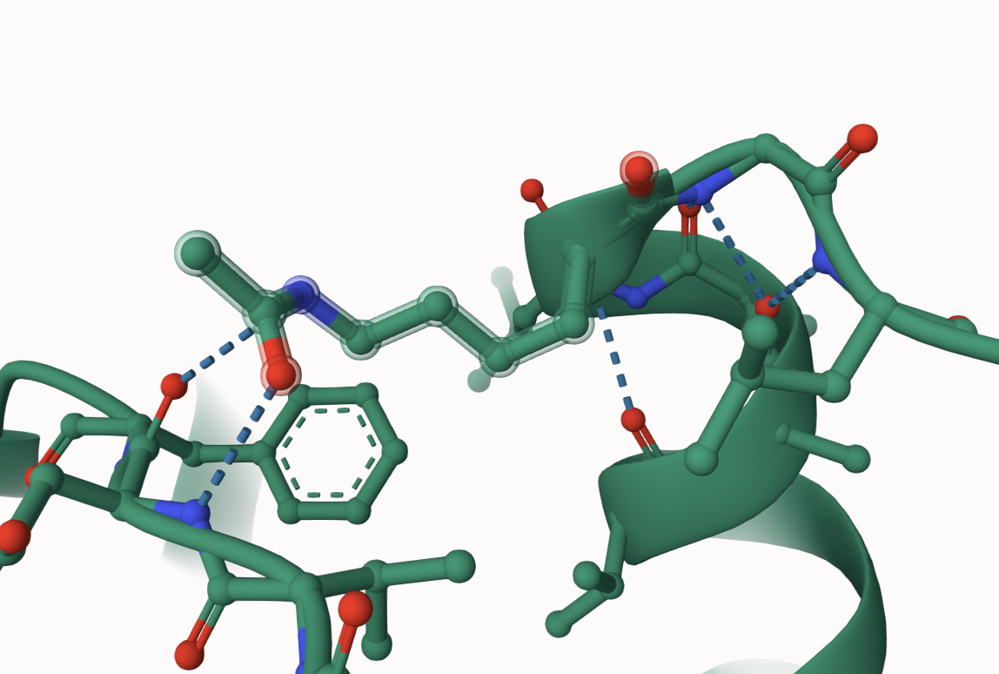
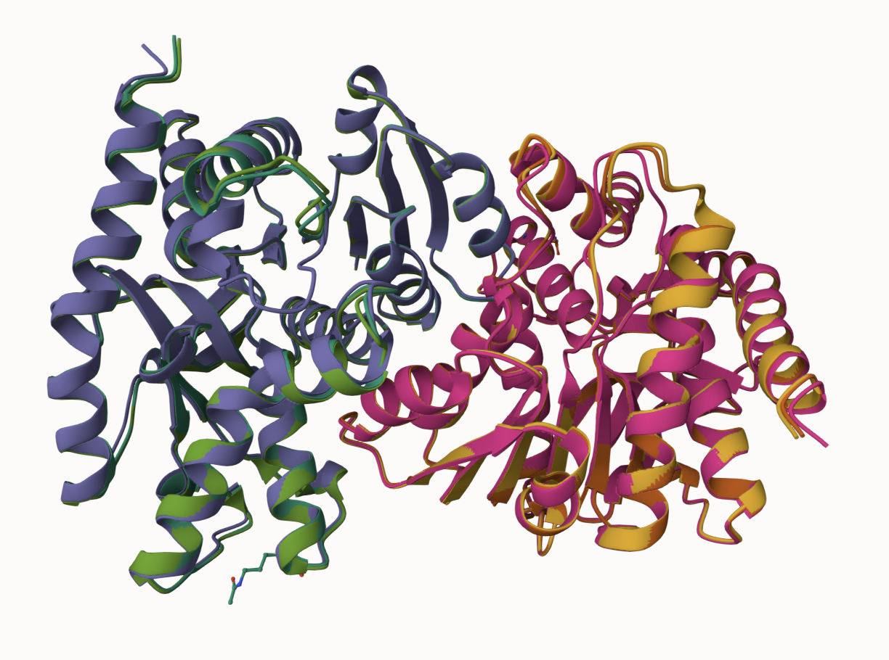
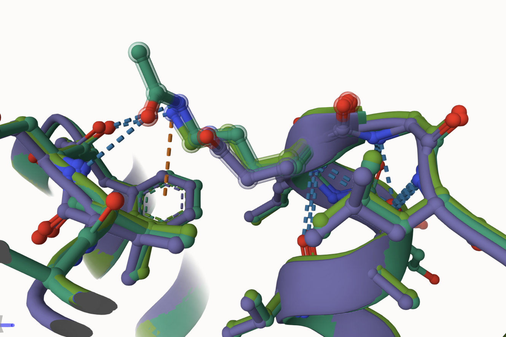
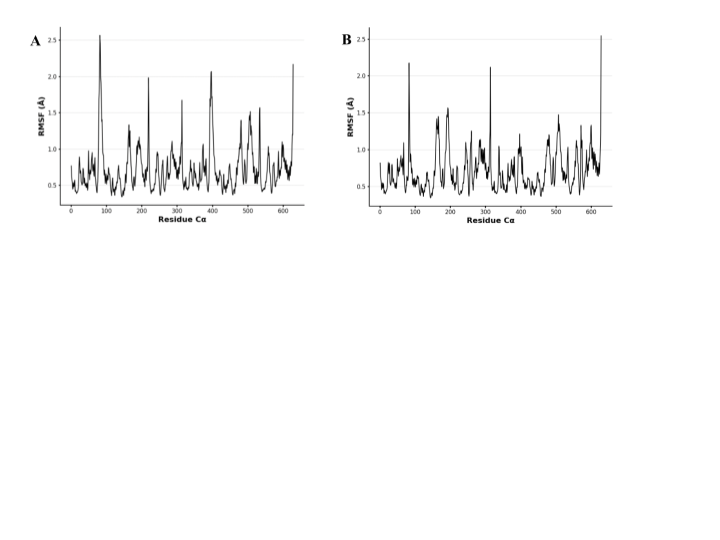
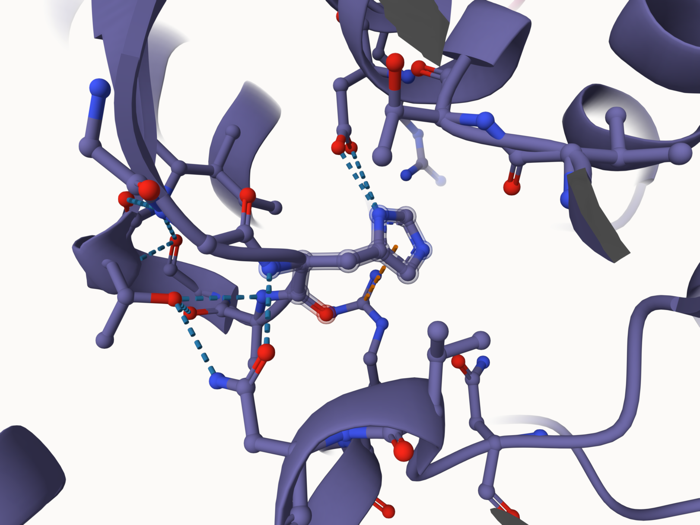
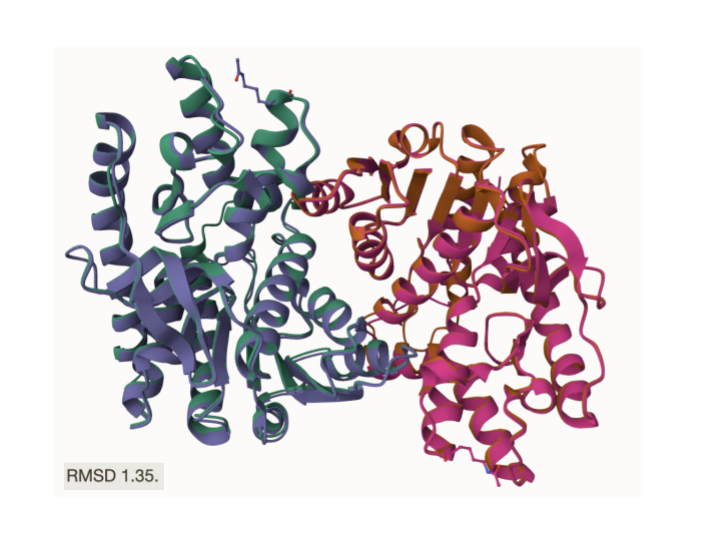

# Homo sapiens MDH2
# P40926
# Variation: acetylation of K185 (ALY185 in structure)

## Description

The modification site addressed is K185 in human malate dehydrogenase two [(P40926)](https://www.uniprot.org/uniprotkb/P40926/entry). This site was mentioned previously in [Zhao and coworkers](https://doi.org/10.1126/science.1179689) from 2010 and focused on mutagenesis, specifically on acetylation, however, there were no findings related to position 185. The study concluded that acetylation plays a prominent role in metabolic regulation1. Further research on lysine acetylation shows that this modification is crucial for regulating enzyme activity, protein interactions, and overall metabolic pathways.

# Comparison of MDH2 models

1. Unmodified MDH2 site

2. Modified MDH2 site

## Effect of the sequence variant and PTM on MDH dynamics

1. Alignment of MDH2, PTM MDH2, and mimic variant MDH2

2. Modification site alignment within MDH2

The modification Acetyllysine is the most noticeable change between sequences as it is larger compared to the original lysine and substitution glutamine

3. Comparison of the enzyme dynamics

After simulation, the dynamics as described by the root mean square fluctuation (RMSF) value were compared. Figure A is the RMSF plot for the original sequence. It shows four peaks and indicates structural flexibility. The peak at ~90 appears higher than the one in the mimic sequence. Figure B is the RMSF plot for the mimic sequence. This plot has three main peaks, indicating more rigidity. The peak at ~300 and ~650 appear higher than the ones in the original. 

4. Effect of modification on the pKa values

The mimic sequence has lower and less fluctuating pKa values compared to the original sequence, indicating a more stable electrostatic environment.

Description of the data and changes

## Comparison of the mimic and the authentic PTM

The RMSD of the mimic and the authentic PTM was 1.35. The overall structure is similar but contain differences between the bonds in the modification and active site.

### Colab notebook links
[MD_simulation_Step1.ipynb](data/colab_1/MD_simulation_Step1.ipynb)
[mdanalysis_colab_Step2.ipynb](data/colab_2/mdanalysis_colab_Step2.ipynb)

## Authors
Contributors names
Sarah E. Rush

## Deposition Date
12/6/2024

## License

Shield: [![CC BY-NC 4.0][cc-by-nc-shield]][cc-by-nc]

This work is licensed under a
[Creative Commons Attribution-NonCommercial 4.0 International License][cc-by-nc].

[![CC BY-NC 4.0][cc-by-nc-image]][cc-by-nc]

[cc-by-nc]: https://creativecommons.org/licenses/by-nc/4.0/
[cc-by-nc-image]: https://licensebuttons.net/l/by-nc/4.0/88x31.png
[cc-by-nc-shield]: https://img.shields.io/badge/License-CC%20BY--NC%204.0-lightgrey.svg

## References

* Zhao, S.; Xu, W.; Jiang, W.; Yu, W.; Lin, Y.; Zhang, T.; Yao, J.; Zhou, L.; Zeng, Y.; Li, H.; Li, Y.; Shi, J.; An, W.; Hancock, S. M.; He, F.; Qin, L.; Chin, J.; Yang, P.; Chen, X.; Lei, Q.; Xiong, Y.; Guan, K.-L. Regulation of Cellular Metabolism by Protein Lysine Acetylation. Science 2010, 327 (5968), 1000–1004, https://doi.org/10.1126/science.1179689
